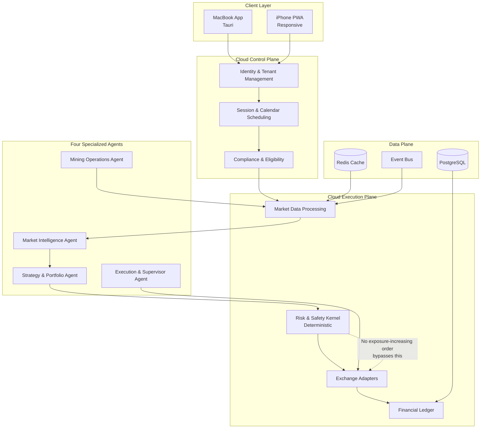

# Kian Trading Intelligence

> **A secure, auditable, cost-aware cryptocurrency trading and mining intelligence platform** combining deterministic execution, validated quantitative intelligence, specialized agents, and human-controlled operational authority.

---

**Amin Azimi · AI Architect · End-to-End System Development Business Challenge · Azimi Innovation Lab**

[]()
[]()
[]()
[]()
[]()
[]()

---

## Current Development Status

| Component | Status | Evidence |
|-----------|--------|----------|
| Repository & Remote | ✅ IMPLEMENTED | GitHub: aminbita162-glitch/kian-trading-intelligence |
| Monorepo Structure | ✅ IMPLEMENTED | `apps/ services/ agents/ packages/ infrastructure/ tests/ docs/` |
| Python / FastAPI Foundation | ✅ IMPLEMENTED | `services/core/` with health endpoint, OpenAPI docs |
| TypeScript Foundation | ✅ IMPLEMENTED | `apps/web/` with Vite + React + TypeScript strict |
| Shared Contracts | ✅ IMPLEMENTED | `packages/contracts/` Pydantic models |
| Dependency Management | ✅ IMPLEMENTED | `pyproject.toml` + `package.json` with lock files |
| Linting & Formatting | ✅ IMPLEMENTED | Ruff (Python), ESLint + Prettier (TypeScript) |
| Unit-Test Framework | ✅ IMPLEMENTED | pytest (Python), Vitest (TypeScript) |
| CI Configuration | ✅ IMPLEMENTED | `.github/workflows/ci.yml` |
| Secret-Handling Rules | ✅ IMPLEMENTED | `.gitignore` + pre-commit secret scan |
| Architecture Documentation | ✅ IMPLEMENTED | `docs/architecture.md` |
| Test House Evidence | ✅ IMPLEMENTED | `test-house/phase-01/` |

> **Production readiness**: This project is in active development (Phase 10 of 10 — all phases implemented). It is NOT production-ready. No live trading, real mining, or real financial operations are enabled or authorized. F-SEC-02 (XOR encryption) and F-SEC-03 (in-memory identity store) remain unresolved release blockers.

---

## Architecture Overview



### Four Agents + Independent Risk Kernel

| Agent | Responsibility | Prohibited |
|-------|---------------|------------|
| **Market Intelligence** | Market observations, feature computation, bounded research summaries | Direct trade execution |
| **Strategy & Portfolio** | Strategy evaluation, portfolio analysis, position proposals | Risk override or self-authorized execution |
| **Execution & Supervisor** | Order lifecycle coordination, exchange adapter orchestration, reconciliation | Bypassing independent risk authorization |
| **Mining Operations** | Mining simulation, profitability assessment, pool/hardware coordination | Unrestricted trading-account access |
| **Risk & Safety Kernel** *(not an agent)* | Deterministic safety validation — tenant, session, capital, exposure, compliance checks | N/A — no order may bypass this |

> **Invariant**: No exposure-increasing order may reach an exchange adapter without valid risk authorization from the independent deterministic Risk & Safety Kernel.

---

## Operating Modes

| Mode | Description | Real Money |
|------|-------------|------------|
| **SIMULATION** | Historical or synthetic data without real financial orders | No |
| **PAPER** | Simulated trading using approved market data or sandbox environments | No |
| **LIVE** | Real financial execution through explicitly authorized providers | Yes (after all gates pass) |

> A mode change must never silently enable real-money trading. All interfaces, records, and audit events must clearly identify the active mode.

---

## Technology Stack

| Layer | Technology |
|-------|-----------|
| Backend | Python 3.11+, FastAPI |
| Interfaces | React, TypeScript 5.6+ |
| MacBook App | Tauri |
| iPhone | Responsive PWA |
| Database | PostgreSQL |
| Cache | Redis |
| Observability | OpenTelemetry-compatible |
| Deployment | Managed cloud (Render planned) |
| CI/CD | GitHub Actions |

---

## Repository Structure

```
kian-trading-intelligence/
├── apps/              # Client applications (web, Tauri)
├── services/         # Backend services
├── agents/           # Specialized AI agents
├── packages/         # Shared contracts and libraries
├── infrastructure/   # Infrastructure configuration
├── tests/            # Integration and end-to-end tests
├── docs/             # Architecture and design documents
├── test-house/       # Durable evidence library
├── .github/workflows/ # CI pipelines
├── DIRECTIV.txt      # Master engineering directive
├── LICENSE           # Proprietary (all rights reserved)
├── README.md         # This file
└── CHANGELOG.md      # Release history
```

---

## Getting Started

### Prerequisites

- Python 3.11+
- Node.js 22+
- PostgreSQL 16+ (for later phases)
- Git

### Backend Setup

```bash
cd services/core
python -m venv .venv
source .venv/bin/activate
pip install -e "../../packages/contracts"
pip install -e ".[dev]"
pytest
```

### Frontend Setup

```bash
cd apps/web
npm install
npm run dev
```

### Running Tests

```bash
# Python tests
pytest

# TypeScript tests
cd apps/web && npm test
```

---

## Engineering Integrity Policy

This project enforces an honest, evidence-based engineering standard:

1. **No fabricated evidence**: Test results, benchmarks, deployment claims, and Git evidence must reflect actual execution.
2. **No production-readiness claims** without passing explicit release gates (Phase 10).
3. **No false features**: Only implemented and verified features are advertised.
4. **No hidden limitations**: Known limits and gaps are documented.
5. **No guaranteed returns**: No strategy may be represented as guaranteed profitable.
6. **No real-money operations** without all technical, security, legal, and human approval gates passing.

---

## Development Phases

| Phase | Objective | Status |
|-------|----------|--------|
| 01 | Repository & Engineering Foundation | ✅ COMPLETE |
| 02 | Identity & Multi-Tenant Security | ✅ COMPLETE |
| 03 | Market Data Foundation | ✅ COMPLETE |
| 04 | Risk Kernel & Trading Execution | ✅ COMPLETE |
| 05 | Financial Ledger & Profit Policies | ✅ COMPLETE |
| 06 | Four-Agent Intelligence | ✅ COMPLETE |
| 07 | Mining Simulation & Safety | ✅ COMPLETE |
| 08 | MacBook & iPhone Applications | ✅ COMPLETE |
| 09 | Security, Resilience & Scale | ✅ IN PROGRESS (branch `phase/09-security-resilience-scale`) |
| 10 | Release Engineering & Controlled Launch | PLANNED |

---

## Third-Party Notices

This project uses third-party open-source components. Their licenses are respected:

- **Python** — PSF License
- **FastAPI** — MIT License
- **Pydantic** — MIT License
- **pytest** — MIT License
- **Ruff** — MIT License
- **React** — MIT License
- **TypeScript** — Apache 2.0 License
- **Vite** — MIT License
- **Vitest** — MIT License
- **ESLint** — MIT License
- **Prettier** — MIT License

Third-party components retain their original licenses; this project's proprietary license does not override them.

---

## Links

- **Repository**: [github.com/aminbita162-glitch/kian-trading-intelligence](https://github.com/aminbita162-glitch/kian-trading-intelligence)
- **Master Directive**: `DIRECTIV.txt` (preserved in repository root)

---

## AUTHOR

> **Amin Azimi**
> AI Architect
> End-to-End System Development Business Challenge
> Azimi Innovation Lab
>
> **Project**: Kian Trading Intelligence
> **Master Engineering Directive**: V1.0 with V1.1 addendum
> **Current software version**: 0.10.0-dev (Phase 10 — Release Engineering and Controlled Launch)
>
> Kian Trading Intelligence is a secure, auditable, cost-aware cryptocurrency trading and mining intelligence platform. It combines deterministic execution, validated quantitative intelligence, four specialized AI agents, and an independent deterministic Risk & Safety Kernel to provide human-controlled operational authority over trading and mining activities. The platform is designed for multi-tenant cloud operation with support for MacBook desktop and iPhone mobile interfaces.
>
> What this project **IS**: A principled engineering effort to build a trading intelligence platform with safety-first architecture, auditable financial operations, tenant isolation, and human-gated execution. It supports simulation, paper trading, and controlled live execution modes with mandatory risk authorization.
>
> What this project **IS NOT**: It is not a get-rich-quick scheme, a guaranteed-profit system, an autonomous trading bot, or a replacement for human financial judgment. No strategy may be represented as guaranteed profitable. No LLM output directly authorizes or executes orders.
>
> What it **DOES**: It provides market intelligence, strategy evaluation, risk management, financial ledger accounting, mining profitability simulation, and controlled trading execution — all with deterministic safety controls and human oversight.
>
> What it **INTENDS TO DO**: Progress through ten controlled development phases, from engineering foundation to controlled launch, with explicit human approval gates at each milestone. Live trading requires all technical, security, legal, and human approval gates to pass.
>
> **Disclaimers**: No guaranteed returns. No unsupported real-trading claims. This repository does not authorize third-party use. Project maturity and regulatory status are accurately represented. No live trading, real mining, or real financial operations are enabled or authorized at this stage.

---

*Proprietary — All Rights Reserved — Amin Azimi / Azimi Innovation Lab*
